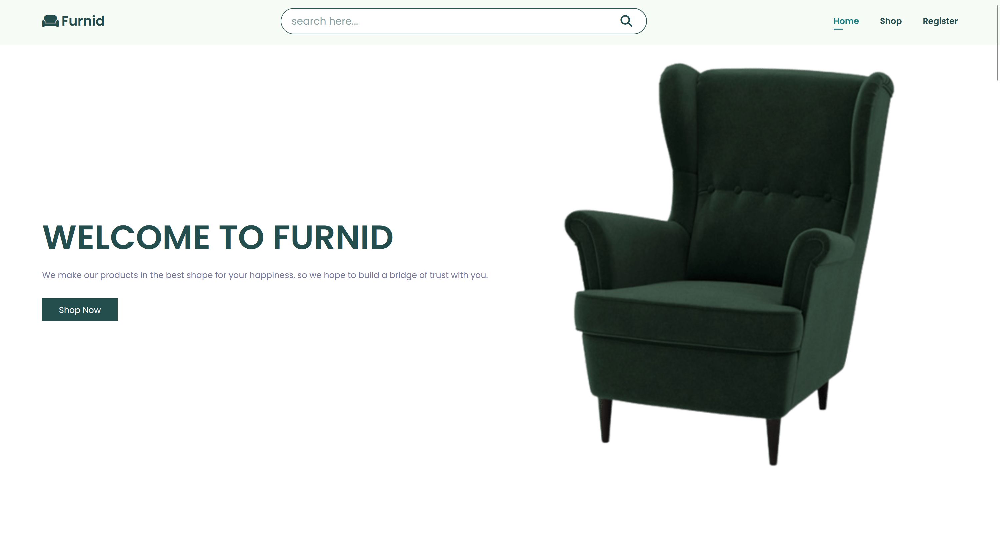
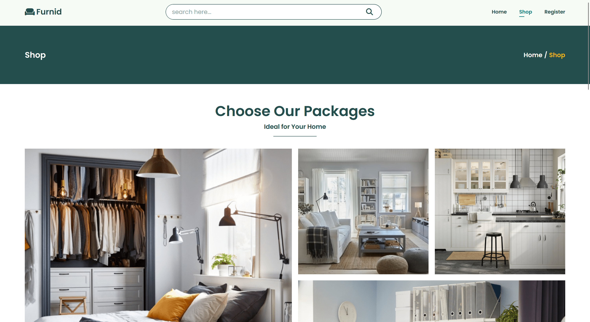
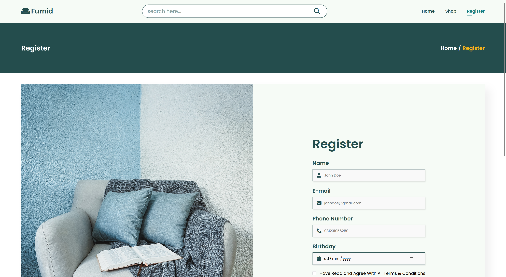

# 🪑 Furnid - Furniture Store Website

**Furnid** is a simple and stylish static website for selling high-quality furniture.  
It’s designed to be clean, modern, and user-friendly, allowing visitors to explore products easily and register for updates.

---

## 🌟 Features
- **Home** – Welcoming landing page with featured furniture.
- **Shop** – Browse our curated collection of tables, chairs, sofas, and more.
- **Register** – Allows visitors to register their details to stay updated with the latest products, offers, and store news.

---

## 🛠️ Built With
- **HTML5** – Semantic and accessible structure.
- **CSS3** – Elegant and responsive styling.
- **JavaScript (ES6)** – Light interactivity.

---

## 📸 Preview

